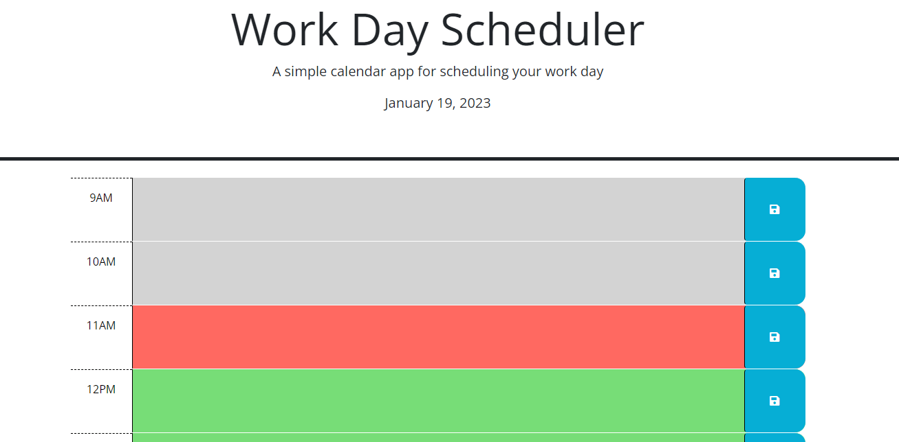

# Personal Planner
A website to help all kinds of users plan their days.

## Description
This website allows users to keep organized by adding events to their work schedule, and see at a glance what hour in the day it is.
   
## Instructions
* To create a new event in the calendar, simply click in the hour in which the event will take place.  Type the event, and then click the save button to the right.
* The colors automatically change in the hours of the day to show whether an hour is future, past, or present.

## Contributors
* <a href="https://github.com/codex-scribe">Matt Brandenburgh</a>

## Screenshot
